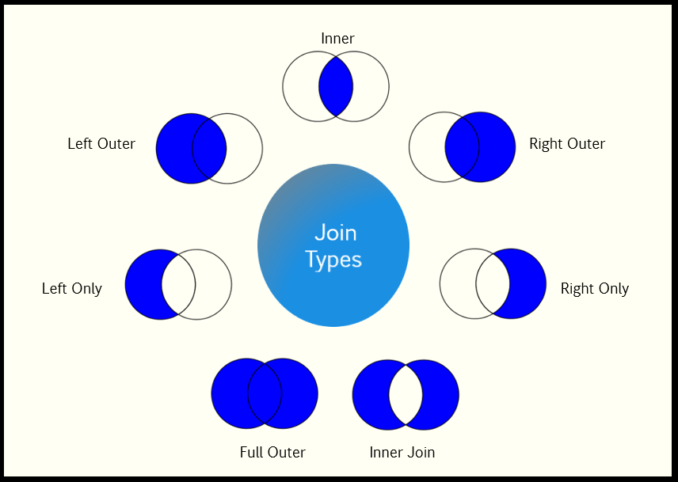

# JOIN

JOIN is used to combine data or rows from two or more tables/datasets based on at least one boolean expression test.

**Note:** When join condition is on STRING case sensitivity matters. For example Sun, SUN, and sun aren't the same. Make sure your STRING values are the same format to capture the matching dataset correctly.

## Join Types

</br>

<p style='color:red'>Inner </p>  
Returns all rows from both the dataset if the condition satisfies. 
This join  will create the result-set by combining all rows from both the datasets where the condition satisfies. This is the default JOIN, so it doesn't need to be declared.

<p style='color:red'>LEFT ONLY </p>
Returns all the rows of the dataset on the left side of the join that didn’t match any rows from right dataset.

<p style='color:red'>LEFT OUTER </p>
Returns all the rows of the dataset on the left side of the join and matching rows for the dataset on the right side of join.

<p style='color:red'>RIGHT ONLY </p>
Returns all the rows of the dataset on the right side of the join that didn’t  match any rows from left dataset.

<p style='color:red'>RIGHT OUTER </p>
Returns all the rows of the dataset on the right side of the join and matching rows for the dataset on the left side of join.

<p style='color:red'>FULL ONLY </p>
Returns all rows from both left and right datasets that don't have a match in opposite dataset.

<p style='color:red'>FULL OUTER  </p>
Returns all rows from both the datasets regardless of join condition.
This join  will create the result-set by combining all rows from both the datasets, including matched and non matched rows. 
For non matched rows, the fields from opposite dataset will remain null.

</br>
</br>



## Syntax

```java
/*** Join with Explicit Transform ***/
attribName := JOIN(LEFT_DatasetName,
                   RIGHT_DatasetName,
                        // JoinConditions - AND/OR/NOT_Equal
                        LEFT.fieldName  = RIGHT.fieldName AND
                        (LEFT.fieldName = RIGHT.fieldName OR,
                        LEFT.fieldName != RIGHT.fieldName),
                    TRANSFORM(Result_RecordLayout,
                            SELF := LEFT,
                            SELF := RIGHT),
                    JOINType
                    [, flags]);


/*** Join with stand-alone Transform ***/
attribName := JOIN(LEFT_DatasetName,
                   RIGHT_DatasetName,
                        // JoinConditions - AND/OR/NOT_Equal
                        LEFT.fieldName  = RIGHT.fieldName AND
                        (LEFT.fieldName = RIGHT.fieldName OR,
                        LEFT.fieldName != RIGHT.fieldName),
                    xFormName(LEFT, RIGHT),
                    JOINType
                    [, flags]);
```

| _Value_                          | _Definition_                                                                                                                        |
| :------------------------------- | :---------------------------------------------------------------------------------------------------------------------------------- |
| attribName                       | The name by which the join will be invoked.                                                                                         |
| LEFT_DatasetName                 | Left dataset of the join. LEFT is the first dataset passed to JOIN.                                                                 |
| RIGHT_DatasetName                | Right dataset of the join. RIGHT is the second dataset passed to JOIN.                                                              |
| LEFT.fieldName = RIGHT.fieldName | Join matching condition, it can use equal (=) or not-equal (!=). Join can take place on multiple conditions can exists using AND/OR |
| Transform/xFormName              | Explicit or stand-alone TRANSFORM. Keep in mind that you are passing two arguments to JOIN (left dataset and right dataset).        |
| JoinType                         | Default is Inner join.                                                                                                              |
| Flags                            | Optional                                                                                                                            |

### Optional Flags

<p style='color:pink'>LOOKUP </p>
The <u>right</u> dataset is relatively small and there should be only <u>one match</u> for any LEFT record.

<p style='color:pink'>ALL </p>
The <u>right</u> dataset is relatively small and can be copied to every node in its entirety.

- Can have multiple matches (unlike LOOKUP)
- Supports join conditions that contain no equalities
- Required if there are no equality tests in the condition

<p style='color:pink'>FEW </p>
Few Specifies the LOOKUP <u>right</u> dataset has few records, so little memory is used.

<p style='color:pink'>NOSORT </p>
NOSORT Performs the JOIN without dynamically sorting the tables. This implies that the left and/or right record-set must have been previously sorted and partitioned based on the fields specified in the join Condition.

<p style='color:pink'>KEYED </p>
KEYED Specifies using indexed access into the <u>right</u> record-set.

<p style='color:pink'>LOCAL </p>
LOCAL JOIN performed on each supercomputer node independently, and maintains the pervious distribution of data.

<p style='color:pink'>KEEP(n) </p>
KEEP(n) Specifies the maximum number of matching records (n) to generate into the result set. If omitted, all matches are kept.

<p style='color:pink'>LIMIT </p>
LIMIT Specifies a maximum number of matching records which, if exceeded, either fails the job, or eliminates all those matches from the result set.

**Demo Dataset**

Left dataset (StudentDS)

| StudentID | Name  | ZipCode | Age | Major   | isGraduated |
| :-------- | :---- | :------ | :-- | :------ | :---------- |
| 100       | Zorro | 30330   | 26  | History | TRUE        |
| 409       | Dan   | 40001   | 26  | Nursing | FALSE       |
| 300       | Sarah | 30000   | 25  | Art     | FALSE       |
| 800       | Sandy | 30339   | 20  | Math    | TRUE        |
| 202       | Alan  | 40001   | 33  | Math    | TRUE        |
| 604       | Danny | 40001   | 18  | N/A     | FALSE       |
| 305       | Liz   | 30330   | 22  | Chem    | TRUE        |
| 400       | Matt  | 30005   | 22  | Nursing | TRUE        |

Right Dataset(MajorDS)

| MajorID | MajorName   | NumOfYears | Department |
| :------ | :---------- | :--------- | :--------- |
| M101    | Dentist     | 5          | medical    |
| M102    | Nursing     | 4          | Medical    |
| M201    | Surgeon     | 12         | Medical    |
| S101    | Math        | 4          | Science    |
| S333    | Computer    | 4          | Science    |
| A101    | Art         | 3          | Art        |
| A102    | Digital Art | 3          | Art        |

#### Example

<br>
<pre id = 'JoinExp_1'>

```java
/*
JOIN Example:
JOIN examples showing case sensitivity and logical operations
*/

//Importing standard library for string manipulation
IMPORT STD;

StudentRec := RECORD
  INTEGER  StudentID;
  STRING   Name;
  STRING   ZipCode;
  INTEGER  Age;
  STRING   Major;
  BOOLEAN  isGraduated;
END;


StudentDS := DATASET([{100, 'Zorro',  30330, 26, 'History', TRUE}, {409, 'Dan', 40001, 26, 'Nursing', FALSE},
                     {300, 'Sarah', 30000, 25, 'Art', FALSE}, {800, 'Sandy', 30339, 20, 'MAth', TRUE},
                     {202, 'Alan', 40001, 33, 'Math', TRUE}, {604, 'Danny', 40001, 18, 'N/A', FALSE},
                     {305, 'Liz',  30330, 22, 'Chem', TRUE}, {400, 'Matt', 30005, 22, 'nursing', TRUE}],
                    studentRec);

MajorRec := RECORD
  STRING  MajorID;
  STRING  MajorName;
  INTEGER NumOfYears;
  STRING  Department;
END;

MajorDS := DATASET([{'M101', 'Dentist', 5, 'medical'}, {'M102', 'Nursing', 4, 'Medical'}, {'M201', 'Surgeon', 12, 'Medical'},
                   {'S101', 'Math', 4, 'Science'}, {'S333', 'Computer', 4, 'Science'}, {'A101', 'Art', 3, 'Art'},
                   {'A102', 'Digital Art', 3, 'Art'}],
                   majorRec);

getMajorRec := RECORD
  STRING Name;
  STRING Major;
  STRING YearsTotal;
  STRING Department;
END;

// Display all students that have a major defined in majorDS
// Using ToUpperCase to make sure all values have the same case sensitivity
WithCase := JOIN(studentDS, majorDS,
                 STD.Str.ToUpperCase(LEFT.major) = STD.Str.ToUpperCase(RIGHT.MajorName),
                 TRANSFORM(getMajorRec,
                           SELF.YearsTotal := (STRING)RIGHT.NumOfYears;
                           SELF := LEFT;
                           SELF := RIGHT));

OUTPUT(WithCase, NAMED('WithCase'));

// Display all students that have a major defined in majorDS
// Using the string values as they are
WithoutCase := JOIN(studentDS, majorDS,
                 LEFT.major = RIGHT.MajorName,
                 TRANSFORM(getMajorRec,
                           SELF.YearsTotal := (STRING)RIGHT.NumOfYears;
                           SELF := LEFT;
                           SELF := RIGHT));

OUTPUT(WithoutCase, NAMED('WithoutCase'));

// Display all students that have a major defined in majorDS
// And have more than 3 years in NumOfYears
GetStudents := JOIN(studentDS, majorDS,
                 STD.Str.ToUpperCase(LEFT.major) = STD.Str.ToUpperCase(RIGHT.MajorName) AND
                 RIGHT.NumOfYears > 3,
                 TRANSFORM(getMajorRec,
                           SELF.YearsTotal := (STRING)RIGHT.NumOfYears;
                           SELF := LEFT;
                           SELF := RIGHT));

OUTPUT(GetStudents, NAMED('GetStudents'));

```

</pre>
<a class="trybutton" href="javascript:OpenECLEditor(['JoinExp_1'])"> Try Me </a>

</br>
</br>

**Demo Dataset**

Left Dataset
ColorID|Color|isDark
|---|---|---
1 | Blue | 1
2 | Red | 0
3 | Black | 1
4 | Green | 1
5 | Olive | 0
11 | Maroon | 1

Right Dataset:

| ID  | Hue   | Code    |
| --- | ----- | ------- |
| 2   | Red   | #FF0000 |
| 3   | Black | #000000 |
| 4   | Green | #008000 |
| 8   | Green | #FFC0CB |
| 10  | Red   | #000000 |
| 12  | Lime  | #00FF00 |

<br>
<pre id = 'JoinExp_2'>

```java

/*
JOIN Example:
Showing the difference between join types.
*/

ColorRec := RECORD
    INTEGER   ColorID;
    STRING    Color;
    BOOLEAN   isDark;
END;

ColorsDS := DATASET([{1, 'Blue', 1}, {2, 'Red', 0},
                     {3, 'Black', 1}, {4, 'Green', 1},
                     {5, 'Olive', 0}, {11, 'Maroon', 1}],
                     ColorRec);


ColorCodeRec := RECORD
    INTEGER ID;
    STRING  Hue;
    STRING  Code;
END;

ColorCodeDS := DATASET([{2, 'Red', '#FF0000'}, {3, 'Black', '#000000'},
                        {4, 'Green', '#008000'}, {8, 'Green', '#FFC0CB'},
                        {10, 'Red', '#000000'}, {12, 'Lime', '#00FF00'}],
                        ColorCodeRec);

ColorResRec := RECORD
    INTEGER  ColorID;
    STRING   Color;
    STRING   Hue;
    STRING   ColorCode;
    STRING   Category;
END;


//***************************************************************************
// LEFT ONLY
LeftOnly := JOIN(ColorsDS,   // LEFT dataset
                ColorCodeDS, // RIGHT dataset
                 LEFT.ColorID = RIGHT.ID,   // Marching condition
                 TRANSFORM(ColorResRec,
                    SELF.ColorCode := RIGHT.Code,
                    SELF.Category  := IF(LEFT.isDark, 'Dark', 'Bright'),
                    SELF := LEFT,
                    SELF := RIGHT
                    ),
                    LEFT ONLY);

OUTPUT(LeftOnly, NAMED('LeftOnly'));

//***************************************************************************
// LEFT Outer
LeftOuter := JOIN(ColorsDS,   // LEFT dataset
                ColorCodeDS, // RIGHT dataset
                 LEFT.ColorID = RIGHT.ID,   // Marching condition
                 TRANSFORM(ColorResRec,
                    SELF.ColorCode := RIGHT.Code,
                    SELF.Category  := IF(LEFT.isDark, 'Dark', 'Bright'),
                    SELF := LEFT,
                    SELF := RIGHT
                    ),
                    LEFT Outer);

OUTPUT(LeftOuter, NAMED('LeftOuter'));

//***************************************************************************
// FULL ONLY
FullOnly := JOIN(ColorsDS,
                ColorCodeDS,
                 LEFT.ColorID = RIGHT.ID,
                 TRANSFORM(ColorResRec,
                    SELF.ColorCode := RIGHT.Code,
                    SELF.Category  := IF(LEFT.isDark, 'Dark', 'Bright'),
                    SELF := LEFT,
                    SELF := RIGHT
                    ),
                    FULL ONLY);

OUTPUT(FullOnly, NAMED('FullOnly'));

// Full OUTER
FullOuter := JOIN(ColorsDS,
                ColorCodeDS,
                 LEFT.ColorID = RIGHT.ID,
                 TRANSFORM(ColorResRec,
                    SELF.ColorCode := RIGHT.Code,
                    SELF.Category  := IF(LEFT.isDark, 'Dark', 'Bright'),
                    SELF := LEFT,
                    SELF := RIGHT
                    ),
                    FULL OUTER);

OUTPUT(FullOuter, NAMED('FullOuter'));
```

</pre>
<a class="trybutton" href="javascript:OpenECLEditor(['JoinExp_2'])"> Try Me </a>

</br>
